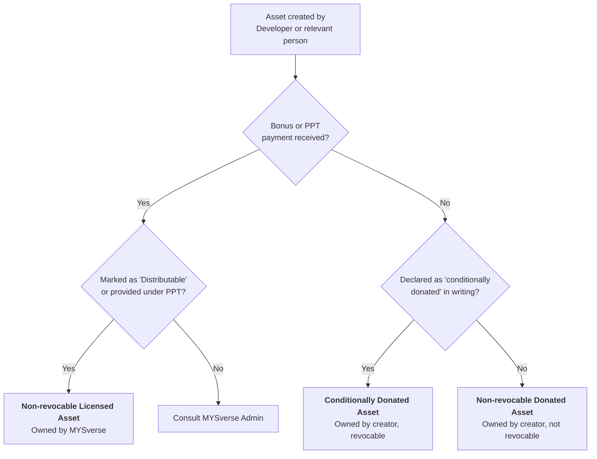
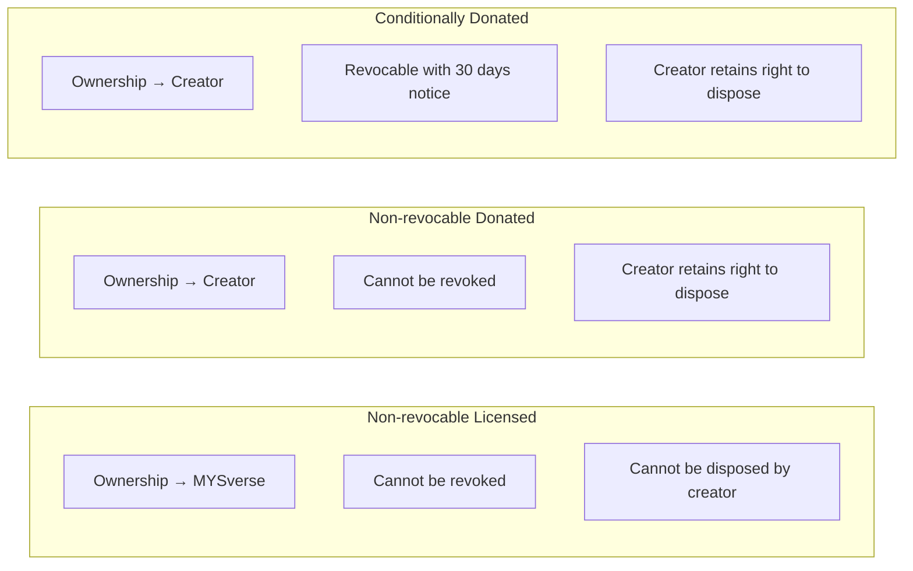
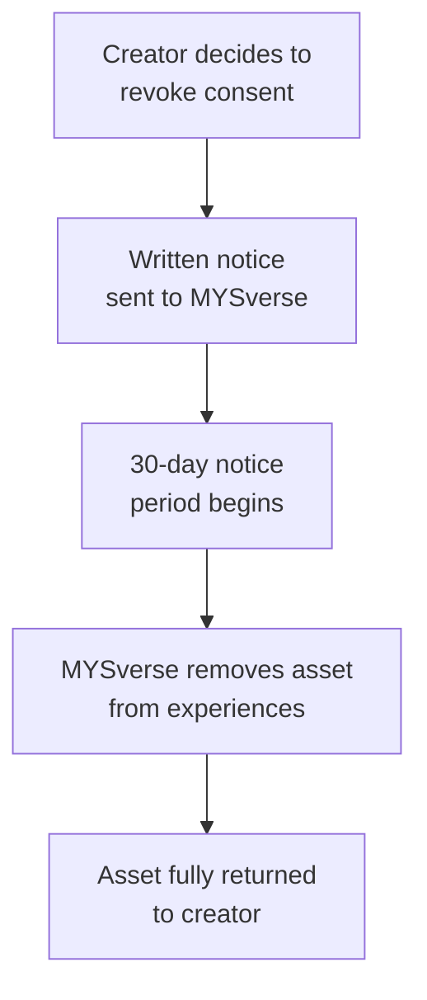

# Asset Rights and Ownership Policy Regulations

*Made: 8 January 2026 · Last updated: 8 January 2026*

## Purpose

The purpose of these Regulations is to clarify the nature of asset and ownership policy rights within MYSverse, whether in relation to assets made by or donated by Developers, or other persons for use in MYSverse experiences.

## Definitions

| Term | Definition |
|---|---|
| **Ownership** | The right to possess, use, control (whether actual or intended), enjoy, and dispose |
| **Dispose** | The right to redistribute or resell to a third party, or use for the purposes of non-MYSverse activity |
| **Licence** | The right to possess, use, control (whether actual or intended), and enjoy, but not dispose |
| **Developer** | Any person under the direction and control of MYSverse Development |
| **Relevant person** | A person who is not a Developer but who these Regulations apply to, and may include contractors and Sim agency/department developers |
| **Bonus** | Payment received by any person or Developer in return for goods or services |

## Asset Classification

The following flowchart illustrates how to determine which category an asset falls into:

---

## 1. Non-revocable Licensed Assets

**(1)** Non-revocable licensed assets include assets:
- Whether made or obtained by a Developer or relevant person;
- Which a bonus has been provided for by MYSverse; **and**
- Which has been entered as a task on the Linear software and marked as "Distributable"; or which has been provided to MYSverse by a Developer or relevant person under the "Pay per task" programme.

**(2)** Non-revocable licensed assets shall be for the sole and exclusive use of all MYSverse experiences, and consent to make use of such assets cannot be revoked by a Developer or relevant person.

**(3)** Ownership of non-revocable licensed assets shall vest with MYSverse.

## 2. Non-revocable Donated Assets

**(1)** Donated assets are assets:
- Whether made or obtained by a Developer or relevant person; **and**
- Which a bonus has **not** been provided for by MYSverse; or which has been entered as a task on the Linear software and marked as "Redistributed".

**(2)** The Developer or relevant person shall retain ownership of any donated assets (including the right to dispose), but may choose to provide them to MYSverse for use in any MYSverse experiences as the Developer or relevant person consents to.

**(3)** Such consent, unless agreed to by MYSverse, cannot, in the ordinary course of events, be revoked by a Developer or relevant persons.

## 3. Conditionally Donated Assets

**(1)** Conditionally donated assets are assets:
- Whether made or obtained by a Developer or relevant person;
- Which the Developer or relevant person has made known **in writing** to MYSverse that the asset is a "conditionally donated asset"; **and**
- Which a bonus has **not** been provided for by MYSverse; or which has been entered as a task on the Linear software and marked as "Redistributed".

**(2)** The Developer or relevant person shall retain ownership of any conditionally donated assets (including the right to dispose), but may choose to provide them to MYSverse for use in any MYSverse experiences as the Developer or relevant person consents to.

**(3)** Consent for MYSverse to make use of such assets may be revoked by the Developer or relevant person at any time in writing, provided at least **30 days** or a reasonable period of time is provided to physically remove any such assets from MYSverse experiences.

## Rights Comparison

## Revocation Process

For conditionally donated assets, consent may be revoked as follows:

## Summary

| Asset Type | Paid? | Ownership | Can Dispose? | Revocable? |
|---|---|---|---|---|
| **Non-revocable Licensed** | Yes (bonus or PPT) | MYSverse | No | No |
| **Non-revocable Donated** | No | Creator | Yes | No |
| **Conditionally Donated** | No | Creator | Yes | Yes (30 days notice) |

---

*MYSverse Administration*
