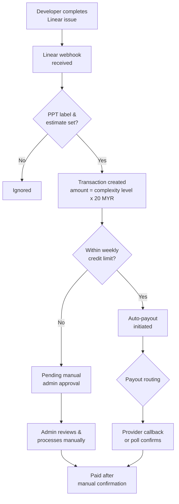
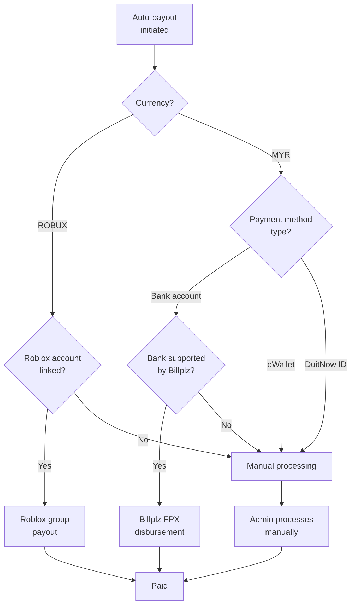

# Payment Flow

This page explains how payments work on the MYSverse DevHub platform — from completing a task to receiving your payout.

## Payment Lifecycle

When a developer completes a task on Linear, the platform automatically creates a transaction and routes it to the appropriate payment provider.

### How amounts are calculated

- DevHub uses complexity levels 1-5 for displayed payout math.
- Linear stores those levels as Fibonacci estimates: `1 -> 1`, `2 -> 2`, `3 -> 3`, `5 -> 4`, `8 -> 5`.
- Payment amount = normalized complexity level x RM20 (MYR).
- For Robux payouts, the amount is normalized complexity level x 1,200 Robux.

## Payout Routing

The system automatically selects the best payment provider based on your currency, payment method, and account configuration.

### Payment providers

| Provider | Currency | Methods | Type |
|---|---|---|---|
| **Billplz** | MYR | FPX bank transfers (20 supported banks) | Automatic |
| **Roblox** | ROBUX | Roblox group payout | Automatic |
| **Manual** | Any | Admin processes via bank transfer, PayPal, etc. | Manual |

### eWallet and DuitNow ID payouts

Payouts to an eWallet institution, or to a DuitNow ID (mobile number, NRIC,
passport, business registration or army/police number), are processed by an
administrator through our bank. They are not automated, and they never require
identity verification.

A DuitNow ID only works if you have linked it as a DuitNow ID at the bank or
e-wallet you name in your payment settings — having the number in the app is
not the same thing. A passport ID also needs its issuing country, because our
bank asks for it before the passport number.

## Identity verification (KYC)

**DevHub no longer collects identity documents.** Verification previously
existed only to satisfy a payment partner that offered automated eWallet
disbursement; that partnership did not go ahead, so the requirement no longer
applies to anyone.

If you submitted documents while the programme was running, see our
[AML/KYC Policy](/policy/aml-kyc) for what is still held, what was deleted,
and your rights over it.

### Key points

- **No verification is required to be paid** — not for bank transfers, eWallets, DuitNow IDs, PayPal or Robux
- **Nothing is collected any more** — the upload form has been removed
- **Documents already submitted were deleted** — within 48 hours of review, as promised at the time
- **Results are retained** — approved/rejected outcomes and the reviewer audit log are kept as a compliance record
