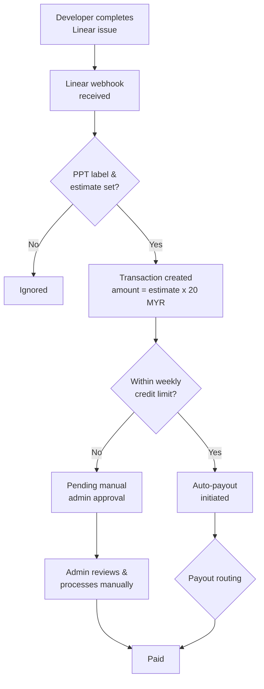
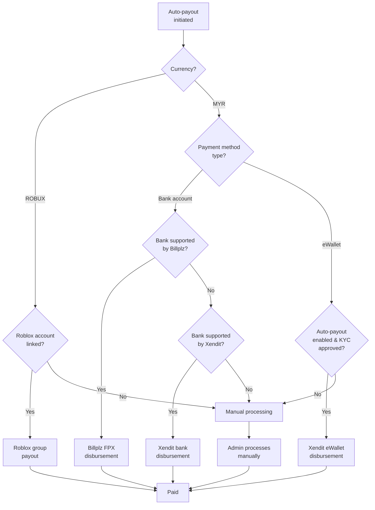
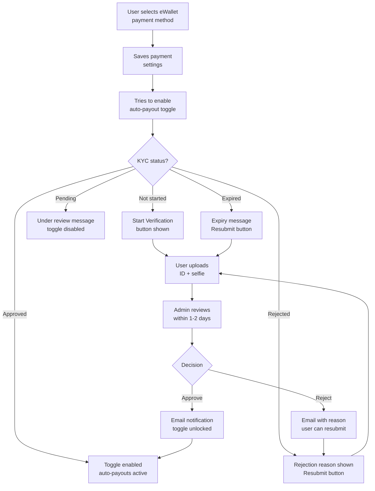

# Payment Flow

This page explains how payments work on the MYSverse DevHub platform — from completing a task to receiving your payout.

## Payment Lifecycle

When a developer completes a task on Linear, the platform automatically creates a transaction and routes it to the appropriate payment provider.

### How amounts are calculated

- Each Linear issue has a complexity estimate (1-5 points)
- Payment amount = estimate points x RM 20 (MYR)
- For Robux payouts, the amount is converted at the applicable rate

## Payout Routing

The system automatically selects the best payment provider based on your currency, payment method, and account configuration.

### Payment providers

| Provider | Currency | Methods | Type |
|---|---|---|---|
| **Billplz** | MYR | FPX bank transfers (20 supported banks) | Automatic |
| **Xendit** | MYR | Bank transfers (22 banks) + eWallets (TnG, GrabPay, etc.) | Automatic |
| **Roblox** | ROBUX | Roblox group payout | Automatic |
| **Manual** | Any | Admin processes via bank transfer, PayPal, etc. | Manual |

### eWallet automatic payouts

eWallet payouts (TnG E-Wallet, GrabPay, Boost, etc.) through Xendit require:

1. **Identity verification (KYC)** — a one-time process where you upload your government ID and a selfie
2. **Auto-payout opt-in** — you must explicitly enable automatic payouts in your settings

Without these, your eWallet payouts are processed manually by an administrator. See our [AML/KYC Policy](/policy/aml-kyc) for details on the verification process.

## KYC Verification Flow

If you choose to enable automatic eWallet payouts, here is the verification process:

### Key points

- **KYC is optional** — it is only needed if you want automatic eWallet payouts
- **One-time process** — once approved, verification does not need to be repeated
- **Documents deleted quickly** — your ID and selfie are deleted within 48 hours of review
- **You can opt out** — disable automatic payouts at any time to revert to manual processing
